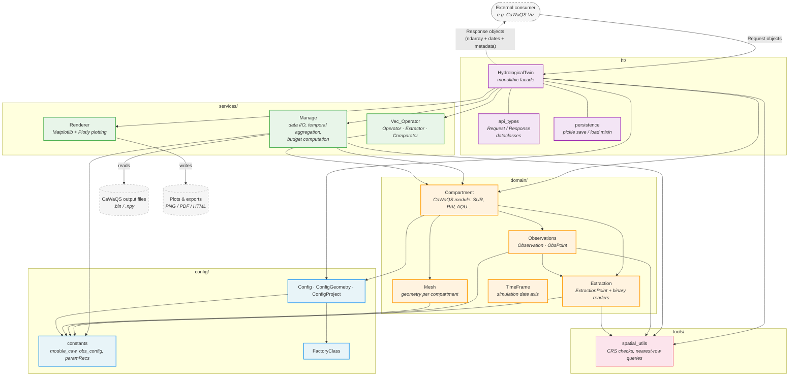

# HydrologicalTwinAlphaSeries

HydrologicalTwinAlphaSeries is the standalone scientific backend supporting CaWaQS-ViZ.

It serves as a proof-of-concept (POC) for the HydrologicalTwin framework and is dedicated to the definition, validation, and consolidation of its core computational structures.

The repository provides the backend layer required to structure hydrological simulation outputs, expose controlled programmatic interfaces, and support post-processing workflows required by the visualization layer. It focuses strictly on the backend domain, including data structuring and transformation, computational services, configuration models, and API exposure for external consumers. It does not include user interface components, QGIS integration logic, or visualization responsibilities.

It is intentionally developed independently from the QGIS application layer, which consumes it as an external dependency.

HydrologicalTwinAlphaSeries constitutes the AlphaSeries of the HydrologicalTwin framework. In this context, Alpha does not denote instability in the conventional software sense, but a phase in which the system is under formal construction. Core assumptions, data structures, and computational behaviors are actively explored and stress-tested.

The term Series designates a coherent progression of such states. Each iteration contributes to the convergence toward a stable and reproducible backend foundation, ensuring that future versions rely on explicitly validated principles rather than implicit design choices.

---

## Status

This repository is part of the AlphaSeries phase.

This phase is dedicated to:

* defining core architectural invariants,
* validating backend behaviors under real use cases,
* stabilizing interfaces with the visualization environment.

No long-term API stability is guaranteed at this stage.

---

## Relationship with CaWaQS-ViZ

CaWaQS-ViZ is the primary consumer of this repository.

The integration follows a clear separation of concerns:

* HydrologicalTwinAlphaSeries → backend computation and data structuring
* CaWaQS-ViZ → visualization, interaction, and GIS integration

The backend is intended to be integrated as an external dependency (e.g. Git submodule), avoiding duplication and ensuring consistency between computation and visualization layers.

---

## Repository Structure

* `src/HydrologicalTwinAlphaSeries/domain`
  Core domain entities (e.g. compartments, meshes, observations)

* `src/HydrologicalTwinAlphaSeries/services`
  Computational services and transformation operators

* `src/HydrologicalTwinAlphaSeries/ht`
  Backend facade and exposed API types

* `src/HydrologicalTwinAlphaSeries/config`
  Configuration models and constants

* `src/HydrologicalTwinAlphaSeries/tools`
  Shared utilities

* `tests`
  Backend validation and integration checks

* `docs`
  Technical notes and backend-oriented documentation
  (see [canonical_monolith.md](docs/canonical_monolith.md) for the target architecture,
  [domain_model.md](docs/domain_model.md) for the compartment-centric domain model)

---

## Conceptual Diagram

A high-level view of how scripts inside HydrologicalTwinAlphaSeries connect to
each other, what enters from outside (a consumer such as CaWaQS-Viz, plus
on-disk CaWaQS output files), and what leaves (plots and exports). The diagram
is intentionally script-level: it shows package boundaries and import
direction, not function-call sequences.



| Layer | Role |
|-------|------|
| **`ht/`** (purple) | Public surface. `HydrologicalTwin` is the single entry point for external consumers; `api_types` defines the Request/Response contract; `persistence` adds pickle save/load. |
| **`services/`** (green) | Stateless computation. `Manage` handles binary I/O and temporal aggregation, `Vec_Operator` groups vectorized operators (transform / extract / compare), `Renderer` produces plots. |
| **`domain/`** (orange) | Domain entities. `Compartment` aggregates `Mesh`, `Observations`, and `Extraction`; `TimeFrame` carries the simulation date axis. |
| **`config/`** (blue) | Configuration models (`ConfigGeometry`, `ConfigProject`), shared `constants` (CaWaQS module names, observation types), and a generic JSON-backed `FactoryClass`. |
| **`tools/`** (pink) | Cross-cutting helpers — currently CRS validation and nearest-row spatial queries. |

**Reading the arrows.** Solid arrows are import / "calls into" relationships in
the direction of dependency. The dashed arrow back to the consumer represents
typed Response objects returned synchronously from the facade. The two
cylinders (`disk_in`, `disk_out`) are the only filesystem boundaries — every
other node is pure Python.

**What this reveals.**
- The facade reaches every package directly; nothing else in the codebase
  imports `ht/`. This is the property that lets the backend be lifted into a
  separate process or server later.
- `Renderer` is the only writer to `disk_out`. In the long-term server
  scenario, this responsibility is expected to move to the frontend so the
  backend returns data instead of files.
- `domain/` depends only on `config/` and `tools/` — it never imports from
  `services/` or `ht/`, which keeps the entity model reusable independently of
  the facade.

---

## Development Principles

* strict separation between computation and visualization layers,
* reproducible backend behavior,
* explicit configuration-driven workflows,
* minimal coupling with external applications.

---

## Integration Workflow

When used within CaWaQS-ViZ:

* this repository is mounted as an external dependency,
* development can occur independently on both sides,
* synchronization is handled through version control (submodule or equivalent mechanism).

---

## Authorship

* Contact: hydrologicaltwin@minesparis.psl.eu
* Project Manager: Nicolas Flipo
* Main Developer: Simone Mazzarelli
* Proto implementation (CaWaQS-ViZ backend): Lise-Marie Girod

Contributors (ongoing):
Tristan Bourgeois, Nicolas Gallois, Fulvia Baratelli, Pierre Guillou, Fabien Ors, Mariam Taki

---

## Positioning

HydrologicalTwinAlphaSeries is not a generic Python package.

It is the computational foundation of a hydrological twin system, currently under active definition and validation.

---

## Getting Started

After cloning the repository, run:

```bash
pixi install
pixi run dev-setup
```

`pixi install` resolves the environment. `pixi run dev-setup` activates the
pre-commit git hook, which runs [ruff](https://docs.astral.sh/ruff/) on staged
files before each commit, auto-fixing what it can. This catches the same
linting issues enforced by CI, one step earlier.

The `dev-setup` step is required only once per clone.

---

## Developer Workflow

CaWaQS-ViZ (frontend, GitLab) consumes HydrologicalTwinAlphaSeries (backend, GitHub)
as a Git submodule. Three scenarios arise depending on where changes are needed.

### 1. Frontend-only changes

Create a branch on the GitLab repository (CaWaQS-ViZ) and work from there.
The submodule is not affected.

### 2. Backend-only changes (no CaWaQS-ViZ testing needed)

Create a branch on the GitHub repository (HydrologicalTwinAlphaSeries) and work
from there. The frontend does not need to be updated until the work is merged.

### 3. Coordinated frontend + backend changes

When both sides need to evolve together — or when backend changes must be
continuously tested through CaWaQS-ViZ — open **two branches with the same name**:
one on GitLab (frontend) and one on GitHub (backend).

#### Initial setup (once per coordinated branch)

1. **Switch the submodule to the target branch**:

   ```bash
   cd external/HydrologicalTwinAlphaSeries
   git checkout <branch-name>
   cd -
   ```

2. **After backend edits, commit and push inside the submodule first.**
   The submodule is its own repository, so its history lives on GitHub
   independently of the parent repo:

   ```bash
   cd external/HydrologicalTwinAlphaSeries
   git add <files>
   git commit -m "<backend commit message>"
   git push origin <branch-name>
   cd -
   ```

3. **Then commit the pointer update** in the parent repo so GitLab
   records the new submodule state:

   ```bash
   git add external/HydrologicalTwinAlphaSeries
   git commit -m "Track backend branch <branch-name>"
   ```

> **Tip:** commit the pointer update frequently. It keeps the frontend
> aligned with the latest backend and avoids large, hard-to-debug jumps.

#### Alternative: track the branch via `.gitmodules`

Instead of running `cd … && git checkout` manually, you can declare the
branch in `.gitmodules`. The `branch` field tells
`git submodule update --remote` which remote branch to fetch the latest
commit from:

```ini
[submodule "external/HydrologicalTwinAlphaSeries"]
    branch = <branch-name>
```

Then, to pull new backend commits into the submodule:

```bash
git submodule update --remote external/HydrologicalTwinAlphaSeries
git add external/HydrologicalTwinAlphaSeries
git commit -m "Update submodule to latest <branch-name>"
```

Note that `git submodule update --remote` only moves the submodule's
working tree to the latest commit of `<branch-name>`. You still need to
`git add` + `git commit` in the parent repo to record the new pointer.

When both branches are merged, reset the field back to `main`:


### Key concepts

| Term | Meaning |
|---|---|
| **Submodule pointer** | A commit hash stored in the parent repo. It pins the exact backend version used. It does not update automatically. |
| `.gitmodules` `branch` field | Tells `git submodule update --remote` which remote branch to fetch. Has no effect without `--remote`. |
| **Detached HEAD** | Normal state for a submodule — it checks out a specific commit, not a branch. |